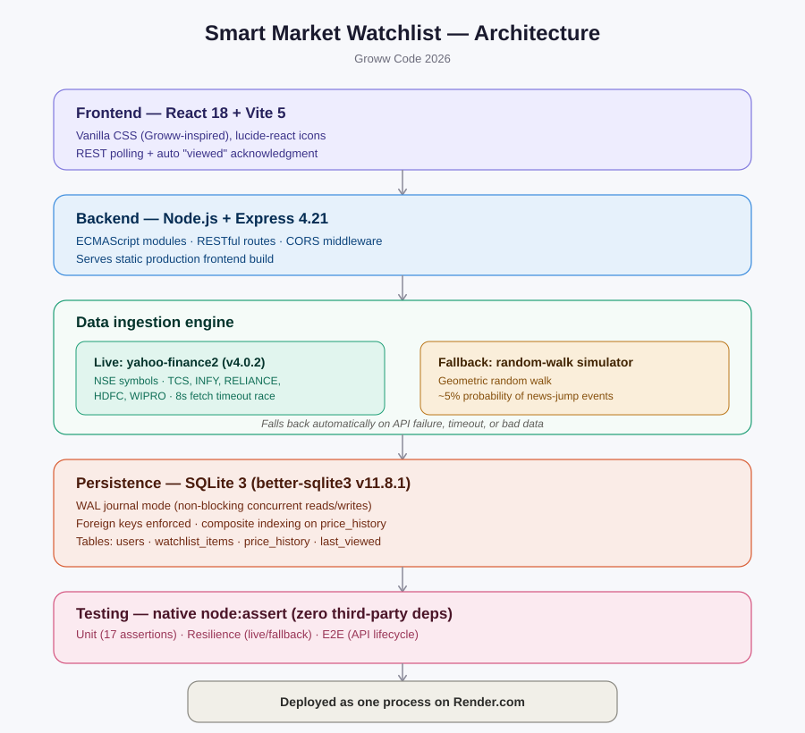

# Smart Market Watchlist

🌐 **[Live Demo](https://smart-market-watchlist-klvd.onrender.com/)**

A contextual stock watchlist designed around how retail investors actually process market shifts. Traditional watchlists flash uncontextualized green and red percentages, leaving users to guess whether a 2% move is routine noise or an exceptional event. This project builds an end-to-end platform that computes baseline volatility for each asset and alerts users only when price action or trading volume breaks out of historical norms.

| Resource | Link / Detail | Status |
|---|---|---|
| Live Product | [smart-market-watchlist-klvd.onrender.com](https://smart-market-watchlist-klvd.onrender.com) | Online |
| Source Code | [github.com/var-13/smart-market-watchlist](https://github.com/var-13/smart-market-watchlist) | Public |
| Automated Tests | 17 unit & resilience test cases | 100% Passing |
| Tech Architecture | React 18 · Node.js Express · SQLite (WAL mode) | Production Build |

## Product Pitch

Inspired by Groww's core philosophy—making finance simple, responsible, and transparent—I built the Smart Market Watchlist to replace raw market noise with actionable context. Most retail investors struggle to interpret whether a daily percentage move matters. By pairing each stock with its 7-day volatility baseline and volume metrics, the system calculates a normalized change_score since the user's last visit. Built end-to-end with React and Node.js/SQLite, it delivers plain-English explanations, dual live/simulated feeds, and persistent visit tracking. It empowers everyday investors to focus only on what truly deserves their attention.

## Full Tech Stack



## Full Tech Stack

- **Frontend:** React 18 (functional components & hooks), built with Vite 5. Custom vanilla CSS in a Groww-inspired fintech style — soft rounded cards, emerald `#00b386` for gains, rose `#eb5b3c` for losses. Icons via `lucide-react`.

- **Backend API:** Node.js + Express 4.21, native ES Modules (`"type": "module"`). Modular REST routes, CORS middleware, and unified static serving for both API and frontend.

- **Data Ingestion Engine:**
  - *Live feed:* `yahoo-finance2` (v4.0.2) pulling real NSE tickers (`TCS.NS`, `INFY.NS`, `RELIANCE.NS`, `HDFCBANK.NS`, `WIPRO.NS`) with an 8-second concurrent timeout.
  - *Fallback:* per-symbol geometric random-walk simulator (~5% news-jump probability) that activates automatically on rate limits (HTTP 429) or timeouts.

- **Persistence Layer:** SQLite 3 via `better-sqlite3` (v11.8.1). `PRAGMA journal_mode = WAL` for non-blocking concurrent reads during writes, foreign keys enabled, composite index on `(symbol, timestamp)`.

- **Testing & Verification:** Native `node:assert` runner, no external test framework. 3 suites covering unit calculations, live-API fallback resilience, and REST API lifecycle.

- **Production Deployment:** Single unified service on Render.com (`AUTO_RUN_PROVIDER=true`), running background price ingestion alongside the API and precompiled React frontend.

## 🏗 Architecture

The system is a five-stage pipeline — raw market data flows in one end, 
a contextual, ranked watchlist comes out the other.



1. **Dual Ingestion** — Live NSE quotes via `yahoo-finance2`, racing an 8-second 
   timeout against zero-downtime automatic fallback to a local simulator.
2. **Data Refinery** — Sanitizes the incoming stream: rejects non-positive prices, 
   negative volumes, and duplicate timestamps before anything touches storage.
3. **Persistent Storage** — SQLite 3 in WAL mode, with atomic batch transactions 
   so reads stay non-blocking even during active writes.
4. **Volatility Brain** — Normalizes each move against the stock's own 7-day 
   volatility baseline ($\text{change\_score} = |\Delta P| / \sigma_{7d}$) and 
   flags volume anomalies ($>2\times$ average).
5. **Groww-Style UI** — A responsive React frontend that surfaces only what's 
   meaningful — outliers sorted to the top, each with a plain-English explanation.

## 💡 "Why This Exists" — Product & Problem Interpretation 

### 1. Market Analysis: Why Did Groww Pose This Challenge?
Over the past five years, retail market participation in India has exploded. Millions of users open their broker app multiple times a day. However, financial interfaces have largely remained unchanged for decades: a static list of tickers displaying raw prices and 1-day percentage fluctuations.

In market microstructure, this creates a severe cognitive problem: **Alert Fatigue & Market Noise**.
- Every trading day, dozens of stocks flash red or green.
- Humans have finite attention. When an investor sees 15 stocks moving between -1.5% and +2.0%, they are forced to perform mental gymnastics: *Is this normal? Did earnings come out? Is the market crashing, or is this just standard intraday fluctuation?*
- The goal of a modern fintech platform is not just to display raw numbers, but to **act as an intelligent filter** that transforms raw data into responsible, transparent insights.

### 2. The Core Insight: Why Static Percentage Thresholds Fail
The intuitive, naive approach to building a "smart" watchlist is to hardcode a threshold—for example, flagging any stock that moves more than 2% or 3%.

**In financial reality, static thresholds fail completely:**
- **The Mega-Cap Reality:** Consider **HDFC Bank** or **TCS**. These are massive, low-beta, defensive institutional pillars. A **2.5% move** in HDFC Bank in a single session is extraordinary—often signaling major RBI policy shifts, systemic banking earnings surprises, or foreign institutional rebalancing. It deserves an immediate, high-priority flag.
- **The High-Beta Reality:** Consider a high-volatility, high-beta stock or a small/mid-cap growth company. A **2.5% intraday swing** is routine background noise that happens multiple times a week without any fundamental news.
- **The Failure:** If you set a fixed 3% threshold, you will **miss the critical HDFC Bank move** (because it rarely hits 3%), while being **spammed with false alarms** on every volatile stock on your list.

### 3. My Mental Model & Thought Process
When approaching Groww's open-ended prompt, I established three foundational product principles:

1. **Information Filtering over Information Overload:** The watchlist must answer one core user question in under three seconds: *"What has changed in a way that actually matters since I last checked?"*
2. **Time-Anchored Delta (User-Centric vs. Market-Centric):** Traditional apps measure percentage change strictly from 9:15 AM market open. But if an investor checks the app at 11:00 AM, returns at 2:30 PM, they don't care about what happened at 10:00 AM. They need to know what transpired **during their absence**. State must persist across visits, establishing a personalized baseline snapshot (`last_viewed_at` and `price_at_last_view`).
3. **Explainable AI/Logic:** Black-box scores alienate users. If a stock is highlighted, the app must explain the mathematical rationale in plain English.


## 📐 The Mathematical Framework: Meaningful Change Engine

Rather than relying on arbitrary thresholds, the system models each stock's historical volatility distribution over a rolling 7-day lookback window.

### 1. Volatility-Normalized Change Score
To determine if a price move is statistically significant, we normalize the raw visit delta against the stock's own historical average daily movement:

$$\text{raw\_pct\_change} = \frac{P_{\text{current}} - P_{\text{baseline}}}{P_{\text{baseline}}} \times 100$$

$$\text{avg\_daily\_move} = \frac{1}{N} \sum_{i=1}^{N} \left| \frac{P_{i,\text{close}} - P_{i,\text{open}}}{P_{i,\text{open}}} \right| \times 100$$

$$\text{change\_score} = \frac{|\text{raw\_pct\_change}|}{\text{avg\_daily\_move}}$$

- **Score Interpretation:**
  - $\text{change\_score} < 1.0$: The move is smaller than a typical day's fluctuation (routine noise).
  - $1.0 \le \text{change\_score} \le 1.5$: Moderate movement within expected variance.
  - $\mathbf{\text{change\_score} > 1.5}$: **Meaningful Move Alert** ($\ge 1.5\times$ typical daily volatility). The stock is automatically badged and sorted to the top.

### 2. Volume Anomaly Detection
Price movement without volume is often an illusion. Conversely, a quiet price move accompanied by massive volume accumulation often precedes major institutional breakouts. We evaluate volume deviation against the 7-day average:

$$\text{volume\_ratio} = \frac{V_{\text{current}}}{\bar{V}_{\text{7d}}}$$

- If $\text{volume\_ratio} \ge 2.0$, the stock triggers a **🔥 Volume Surge** flag, regardless of price magnitude.

### 3. Natural-Language Explainability
The engine outputs human-readable rationales directly into the user interface:
- *"Up 4.2% — 3.5x its usual daily move of 1.2%"*
- *"Unusual volume surge (2.8x avg) with modest price move (+0.4%)"*
- *"Within normal range (+0.35% vs 0.3% avg move)"*
- *"Unchanged since last check"*


## 🛡 Engineering Depth, Edge Cases & Resilience 

| Potential Failure Mode | How the System Defends Against It |
|---|---|
| **External API Rate Limiting (HTTP 429)** | In cloud environments, Yahoo Finance often blocks IP ranges. The ingestion engine wraps external calls in a fallback layer: if Yahoo fails or times out (8s limit), it automatically switches to local simulation per-symbol without throwing errors or halting the app. |
| **Dirty / Corrupt Price Data** | Two-tier data validation (SQL queries + application sanitizer) filters out non-positive prices ($\le 0$), negative volumes, and non-numeric values. Bad data is discarded before any calculation occurs. |
| **Duplicate Timestamps & Race Conditions** | If concurrent ingestion ticks record identical timestamps, the sanitizer filters duplicates preserving the highest auto-incrementing ID, while batch inserts use atomic SQLite transactions (`db.transaction()`). |
| **New Stocks with Zero Historical Baseline** | If a user adds a newly tracked symbol with no historical ticks, the engine handles the boundary condition safely by returning `change_score: 0` and `"No prior view comparison yet"`, preventing `NaN` or application crashes. |
| **Database Lock Contention** | Standard SQLite can lock during simultaneous reads and writes. Enabling `PRAGMA journal_mode = WAL` allows readers to proceed concurrently without blocking tick writes. |


## ⚖ Engineering Trade-offs: What We Did vs. What We'd Do Next

1. **Embedded SQLite vs. Distributed PostgreSQL:**
   - *Current Decision:* SQLite with WAL mode was chosen for zero network latency, instant local testing, and zero external dependency risk during a 72-hour build challenge.
   - *Next Evolution at Scale:* Migrate historical ticks to a distributed time-series database (e.g., TimescaleDB or ClickHouse) while caching user watchlist states in Redis.
2. **REST Polling vs. WebSockets:**
   - *Current Decision:* Adaptive REST polling (every 30s) was implemented to maintain simple, robust HTTP caching semantics and avoid orphan WebSocket connections across mobile disconnects.
   - *Next Evolution at Scale:* Implement Server-Sent Events (SSE) or WebSockets via a pub/sub message broker (Kafka/RabbitMQ) for sub-second price distribution.
3. **Pure Function Engine Isolation:**
   - *Current Decision:* Decoupled the mathematical formula (`calculateMeaningfulChange`) completely from SQLite and Express, enabling 17 unit tests to execute deterministically in milliseconds without mocking databases.


## 🚀 Quickstart & Verification Guide

### 1. Local Setup
```powershell
# Clone the repository
git clone https://github.com/var-13/smart-market-watchlist.git
cd smart-market-watchlist

# Install & initialize backend
cd backend
npm install
npm run db:init

# Optional: seed 7 days of realistic price history for instant baseline context
node simulator.js --seed-history --once

# Install frontend
cd ../frontend
npm install
```

### 2. Running Locally (3 Terminals)
```powershell
# Terminal 1 — API Server:
cd backend ; npm start

# Terminal 2 — Price Feed (Live Yahoo quotes with auto-fallback):
cd backend ; npm run live

# Terminal 3 — Frontend:
cd frontend ; npm run dev
# Open http://localhost:3000
```

### 3. Running the Automated Test Suites
Run all three test suites from the `backend/` directory:
```powershell
cd backend

# 1. Volatility math & data sanitization assertions (17/17 tests)
node test-meaningful-change.js

# 2. Live Yahoo Finance & automatic fallback resilience test
node test-live-provider.js

# 3. REST API lifecycle & endpoint verification
node test-api-e2e.js
```


## 📡 API Reference

| Method | Endpoint | Description |
|---|---|---|
| `GET` | `/watchlist` | Fetches watchlist enriched with `change_score`, `is_meaningful`, `reason`, and `source`, sorted by significance |
| `POST` | `/watchlist` | Adds a stock to the user's watchlist (`{ "symbol": "TCS" }`) |
| `DELETE` | `/watchlist/:symbol` | Removes a symbol from the watchlist |
| `POST` | `/watchlist/viewed` | Acknowledges and updates the `last_viewed` baseline snapshot for all tracked stocks |
| `POST` | `/watchlist/:symbol/viewed` | Updates the baseline snapshot for a single stock |
| `GET` | `/api/health` | Uptime and system health check |
